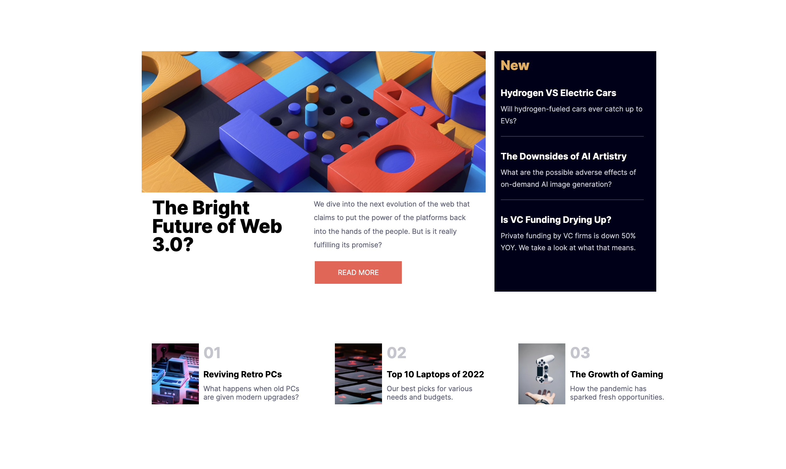

# Frontend Mentor - News homepage solution

This is a solution to the [News homepage challenge on Frontend Mentor](https://www.frontendmentor.io/challenges/news-homepage-H6SWTa1MFl). Frontend Mentor challenges help you improve your coding skills by building realistic projects. 

## Table of contents

- [Overview](#overview)
  - [The challenge](#the-challenge)
  - [Screenshot](#screenshot)
  - [Links](#links)
- [My process](#my-process)
  - [Built with](#built-with)
  - [What I learned](#what-i-learned)
  - [Continued development](#continued-development)
  - [Useful resources](#useful-resources)
- [Author](#author)
- [Acknowledgments](#acknowledgments)

**Note: Delete this note and update the table of contents based on what sections you keep.**

## Overview

### The challenge

Users should be able to:

- View the optimal layout for the interface depending on their device's screen size
- See hover and focus states for all interactive elements on the page

### Screenshot

### Links

- Solution URL: [Add solution URL here](https://your-solution-url.com)
- Live Site URL: [Add live site URL here](https://your-live-site-url.com)

## My process

I build this project first and foremost with mobile first in mind. I tried to go one section by another, untill I felt satisfied with the look and feel. 

### Built with

- Semantic HTML5 markup
- CSS custom properties
- Flexbox
- Mobile-first workflow
- Vanila JS

### What I learned

I learned a lot about positioning in a page, making it responsive. Also learned a few CSS tricks on the way. 

### Continued development

I would love to start using more JS in my projects, learning one project at a time. 

### Useful resources

https://www.w3schools.com/css/css3_flexbox.asp 

## Author

- Frontend Mentor - [@yourusername](https://www.frontendmentor.io/profile/HollowZll)
- Twitter - [@yourusername](https://www.twitter.com/DanielAntipov4)

## Acknowledgments

